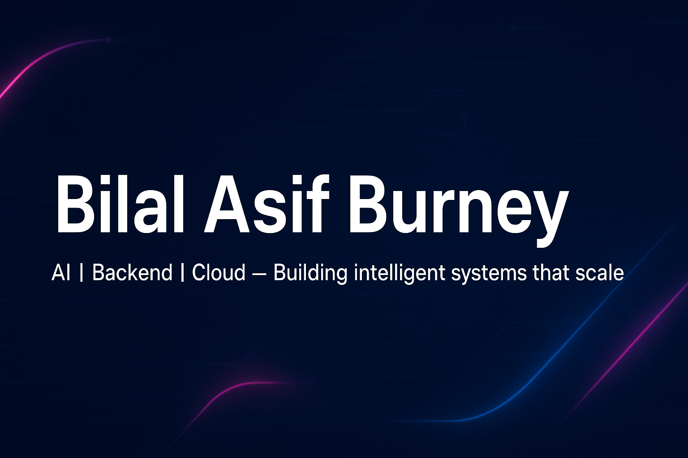

<!-- Header Banner -->
<!-- 

  

 -->

# 👋 Hi, I’m Bilal Asif Burney!

🎓 **Bachelor’s in Artificial Intelligence @ FAST NUCES, Karachi**  
💡 Passionate about AI, backend engineering, and building cloud-native systems  
🏆 Hackathon enthusiast & open-source contributor  

---

## 💬 About Me
I’m an AI student who loves to **build, experiment, and iterate**. My work lives at the intersection of **AI/ML/DL**, **backend systems**, and **DevOps**.  

Whether it’s **optimizing neural networks**, **designing intelligent LLM pipelines**, or **deploying distributed systems**, I enjoy solving problems end-to-end.  
I’m also big on **competitions** — they keep me sharp, curious, and motivated to learn fast.

---

## ⚙️ Tech Stack

  <!-- 🧠 Languages -->
  
  
  
  
  

  <!-- 🗄️ Databases -->
  
  
  

  <!-- ⚙️ Backend Frameworks -->
  
  
  
  

  <!-- 🔄 ORM / Caching / Query -->
  
  

  <!-- 🎨 Frontend -->
  
  

  <!-- 🤖 AI / ML / DL -->
  
  
  
  
  
  
  
  
  
  
  
  
  
  
  
  

  <!-- 🧩 LLM / GenAI -->
  
  
  
  
  

  <!-- ☁️ DevOps / Cloud -->
  
  
  
  

---

## 📂 Featured Projects

### 🧭 [FYP Buddy](https://github.com/BilalAsifB/fyp_buddy)
AI-powered student matching platform using **LangGraph agents** + **Groq LLM**.  
Includes **LangSmith prompt versioning**, **ZenML pipelines**, and **Docker + Azure deployment**.

### 🐾 [AnimalCLEF25 – Animal Re-identification](https://github.com/BilalAsifB/BilalAsifB-AnimalCLEF25-Animal_Reidentification)
Few-shot learning model for animal re-identification using **ConvNeXt + ArcFace + FAISS**.  
Automated **training, tuning, and retrieval** pipeline with Optuna and FAISS.

### 🧬 [Alzheimer’s Disease Classifier](https://github.com/BilalAsifB/Resume_Parser)
Machine learning model for Alzheimer’s detection using **Boruta feature selection**, **PCA**, and **SMOTE**.  
Trained on **SVM** and **Random Forest**, achieving strong performance on imbalanced data.

---

## 🏆 Achievements
- 🥈 **Runner-up** — AI Nexus 25 *(Data Alchemy)*  
- 🏅 **4th Place** — Developers Day 25 *(AI Showdown)*  
- 🧠 **6th Place** — Procom 25 *(Data Science)*  
- ⚙️ **10th Place** — Probattle 25 *(Machine Learning)*  

---

## 🌐 Connect with Me

  
  
  
  

---

## 💭 Quote I Live By
> “We are limited only by our imagination and our will to act.” — Ron Garan

---

## 📊 GitHub Analytics

  
  

---

## 🏆 GitHub Trophies

  

---

## 📈 Contribution Graph

  

---
